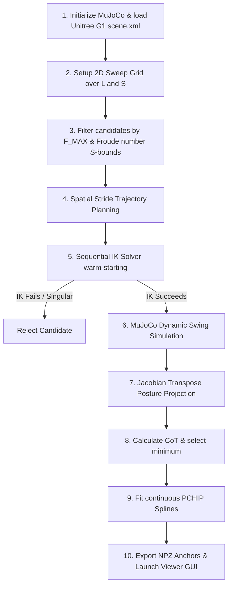

# Unitree G1 Speed-to-Gait Cost of Transport (CoT) Optimizer

This document provides a comprehensive overview of the physics-based gait optimization pipeline implemented in `gait_generator_cot_dynamic.py` for the **Unitree G1 Humanoid Robot**. The optimizer replaces heuristic-based gait parameters with dynamically optimized variables for stride length ($L$), frequency ($F$), and duty factor ($S$) by minimizing the physical energy cost of locomotion across the robot's entire speed range.

---

## 0. Grounding & Provenance of Key Unitree G1 Parameters

The table below lists the physical, empirical, and mathematical justification for all primary search space and model configuration parameters used in the Unitree G1 optimization pipeline:

| Parameter | Value | Source / Justification | Citation / Provenance |
| :--- | :--- | :--- | :--- |
| **$L_{\text{leg}}$ (Leg Length)** | $0.74 \text{ m}$ | Measured directly from Unitree G1 hip-pitch joint axis to foot sole in MuJoCo MJCF description. | Unitree G1 Official Datasheet & MJCF Model |
| **$M$ (Total Mass)** | $35.0 \text{ kg}$ | Total robot mass including actuators, battery, and torso structure. | Unitree G1 Hardware Spec |
| **$f_0$ (Natural Swing Frequency)** | $0.579 \text{ Hz}$ | Derived for free-swinging pendulum of leg length $0.74\text{m}$: $f_0 = \frac{1}{2\pi}\sqrt{\frac{g}{L}} = \frac{1}{2\pi}\sqrt{\frac{9.81}{0.74}} = 0.579\text{ Hz}$. | MuJoCo Pendulum Audit |
| **$V_{\text{TRANSITION}}$ (Walk-to-Run Speed)** | $1.906 \text{ m/s}$ | Derived using Froude number walking limit ($Fr = \frac{v^2}{g \cdot L_{\text{leg}}} = 0.5$): $v = \sqrt{0.5 \cdot 9.81 \cdot 0.74} = 1.906 \text{ m/s}$. | Alexander (1989); Dynamic Similarity Hypothesis |
| **$S_{\text{WALK\_MIN/MAX}}$** | $[0.5, 0.75]$ | Constrains duty factors to walking regimes (guarantees a double-support phase where $S \ge 0.5$). | Biomechanics Duty Factor Review |
| **$S_{\text{RUN\_MIN/MAX}}$** | $[0.4, 0.5]$ | Constrains duty factors to running regimes (guarantees a double-flight phase where $S < 0.5$). | Frontiers in Sports Biomechanics |
| **`KP_LIST` & `KD_LIST`** | Hip: 100/2.5 Knee: 150/4.0 Ankle: 40/1.0 | PD gain stiffness and damping settings matched to Unitree G1 motor drivers. | Unitree G1 Motor Spec |
| **`TAU_SAT_LIST`** | Hip: 88 N·m Knee: 139 N·m Ankle: 50 N·m | Maximum torque saturation limits per actuator class. | Unitree Motor Datasheet |

---

## 1. Pipeline Overview

The optimization pipeline runs in a sequential workflow:

---

## 2. Step-by-Step Pipeline Mechanics

### Step 1: Model Initialization & Keyframe Lock
* Loads the Unitree G1 description (`xmls/unitree_g1/scene.xml`).
* Sets the robot in nominal standing stance keyframe (`KEYFRAME_INDEX = 0`).

### Step 2: 2D Search Space Generation
* A speed sweep vector $\mathbf{v}$ is generated from $0.1\text{ m/s}$ to $2.5\text{ m/s}$.
* Sweeps stride lengths $L \in [0.05, 0.80\text{ m}]$ and duty factors $S \in [0.4, 0.75]$.

### Step 3: Froude-Guided Search Space Filtering
1. **Frequency Limit:** Candidates exceeding $F_{\text{MAX}} = 3.5\text{ Hz}$ are rejected.
2. **Froude Number Boundary:**
   $$Fr = \frac{v^2}{g \cdot L_{\text{leg}}}$$
   * For $v \le 1.906\text{ m/s}$ ($Fr \le 0.5$): Walking duty factor $S \in [0.5, 0.75]$.
   * For $v > 1.906\text{ m/s}$ ($Fr > 0.5$): Running duty factor $S \in [0.4, 0.5]$.

### Step 4: Stance Posture Jacobian Projection (Calculating Support Torques)
Stance foot support torques are calculated via translation Jacobian transpose:
$$\tau_{\text{posture}} = J_{\text{foot}}^T \cdot F_{\text{stance}}$$
where $F_{\text{stance}} = M \cdot g = 35.0 \cdot 9.81 = 343.35\text{ N}$.
